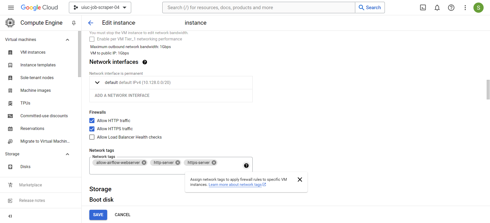
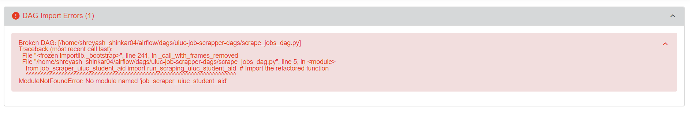

<h1 align="center">UIUC Job Scraper</h1>

### Built With
[![Google Cloud][gcp-logo]][gcp-url]

[![Python][python-logo]][python-url]

[gcp-logo]:https://img.icons8.com/color/48/google-cloud.png
[gcp-url]: https://cloud.google.com/
[python-logo]: https://img.icons8.com/color/48/000000/python.png
[python-url]: https://www.python.org

_____
#### Google Compute Engine VM Instance Configuration
<ul>
    <li>For this project, we utilized a GCP VM Spot Instance to host the local Airflow instance. The chosen configuration was a General Purpose e2-medium for cost-effectiveness.</li>
    <li>Initially, we attempted to leverage GCP's Cloud Composer, a managed orchestration tool and equivalent to Airflow. However, there were configuration challenges with Cloud Composer for economical Compute Engine instances, so we used a locally hosted Airflow instance.</li>
    <li>From instance configuration experiences, we recommend using at least an e2-medium machine to ensure smooth operation of Airflow. This configuration provides adequate computational resources to handle the orchestration tasks efficiently.</li>
</ul>

_____
#### Accessing the Airflow Webserver
During the setup, the Airflow webserver was running correctly on the SSH instance of the GCP VM and was accessible via the terminal. However, the webserver was not accessible at port 8080 initially.
To resolve this issue, a new firewall rule named <code>allow-airflow-webserver</code> was created with the following configuration:
<ul>
    <li><strong>Step 1:</strong> Navigate to the <strong>VPC Network</strong> section in GCP and select <strong>Firewall</strong>.</li>
    <li><strong>Step 2:</strong> Create a new firewall rule with the following settings:
    <li></li>
    <li><strong>Step 3:</strong> Add the firewall rule to the network tags of your instance.</li>
    <li></li>
</ul>
</ul>

_____
### Airflow Interface

_____
### 

_____
### DAGs Orchestration Graph

_____
### MongoDB Database Backend

<a href="#readme-top">back to top</a>

